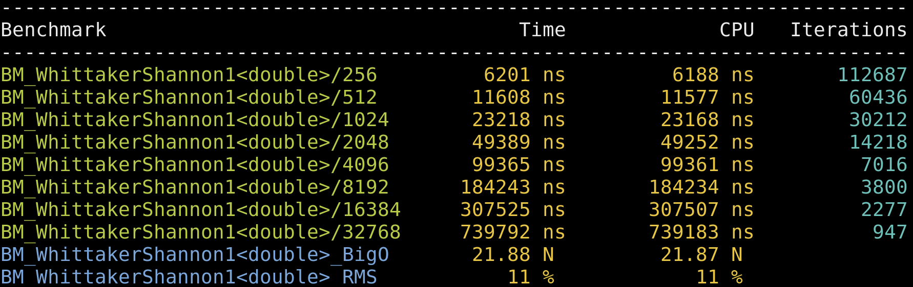
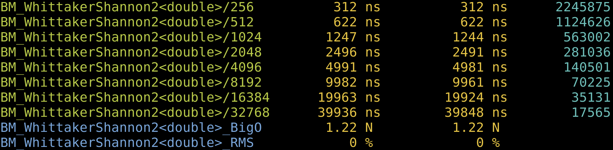
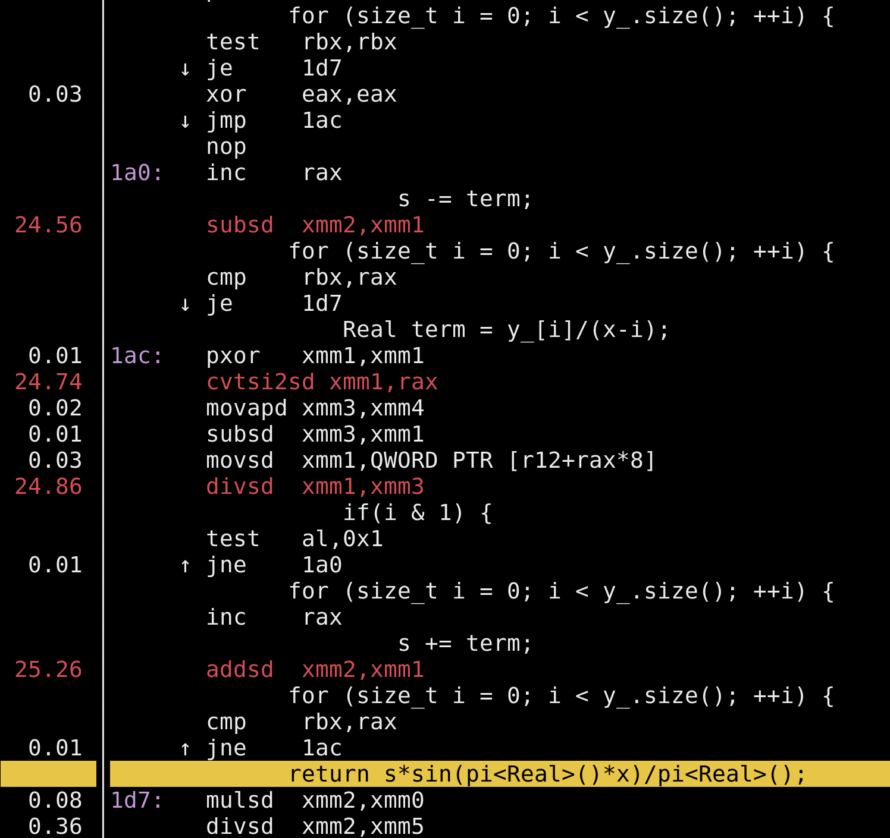
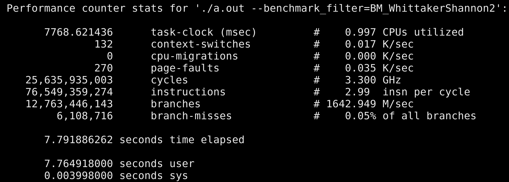

autoscale: true
slidenumbers: true


## An Adventure in Medium Performance Computing

 Nick Thompson

---

## Whittaker-Shannon Interpolation

Suppose $$\{y_i\}_{i=0}^{n-1}$$ are evenly spaced samples of a compactly-supported function $$f$$, so that $$y_i = f(t_0 + ih)$$.

Then a *killer* interpolator for this data is

$$s(t) = \sum_{i=0}^{n-1} y_{i}\mathrm{sinc}\left(\frac{\pi (t - t_0)}{h}  - i \pi\right)$$

---

## But it's slow

$$\mathrm{sinc}$$ has slow decay, so there's no sensible way to truncate the sum.

It's $$\mathcal{O}(n)$$ evaluation, full stop.

---

## I had a use case  . . .

where my best alternative interpolator with $$\mathcal{O}(1)$$ evaluation would use terabytes of RAM, but the Whittaker-Shannon at most a MB.

So I had a big incentive to make it fast . . .

---

## First attempt

```cpp
template<class RandomAccessContainer>
class whittaker_shannon {
public:
    using Real = typename RandomAccessContainer::value_type;
    whittaker_shannon(RandomAccessContainer&& y, Real t0, Real h)
      y_{std::move(y)}, t0_{t0}, h_{h} {}

    Real operator()(Real t) const {
        Real x = boost::math::constants::pi<Real>()*(t-m_t0)/m_h;
        Real s = 0;
        for (size_t i = 0; i < y_.size(); ++i) {
            s += y[i]*boost::math::sinc(x - i*pi<Real>());
        }
        return s;
    }
};
```

---

```cpp
template<class Real>
void BM_WhittakerShannon(benchmark::State& state) {
    std::vector<Real> v(state.range(0));
    std::mt19937 gen(323723);
    std::uniform_real_distribution<Real> dis(-0.95, 0.95);
    for (size_t i = 0; i < v.size(); ++i) {
        v[i] = dis(gen);
    }

    auto ws = whittaker_shannon(std::move(v), Real(0), 1/Real(32));
    Real arg = dis(gen);
    for (auto _ : state) {
        benchmark::DoNotOptimize(ws(arg));
    }
    state.SetComplexityN(state.range(0));
}

BENCHMARK_TEMPLATE(BM_WhittakerShannon, double)->RangeMultiplier(2)
     ->Range(1<<8, 1<<15)->Complexity(benchmark::oN);

BENCHMARK_MAIN();
```

---

## benchmark



---

## perf is no surprise-all in sin


---

## Wisdom

> If you're spending a lot of time evaluating sines and cosines, you're doing something wrong

Use $$\sin(\pi\theta - \pi i) = (-1)^{i}\sin(\pi\theta)$$.

$$s(t) = \frac{\sin\left(\frac{\pi (t - t_0)}{h}\right)}{\pi}\sum_{i=0}^{n-1} \frac{(-1)^{i}y_{i}}{\pi (t - t_0)}{h} - \pi i}$$

---

## Second attempt

```cpp
Real operator()(Real t) const {
    Real x = (t-t0_)/h_;
    Real s = 0;
    for (size_t i = 0; i < y_.size(); ++i) {
        Real term = y_[i]/(x-i);
        if(i & 1) {
            s -= term;
        }
        else {
            s += term;
        }
    }
    return s*sin(pi<Real>()*x)/pi<Real>();
}
```

---

## An order of magnitude faster:



---

## But this gives a catastrophic drop in accuracy

So instead of `sin(pi<Real>*x)`, compute `boost::math::sin_pi(x)`.

---

## Now what's slow?



---

## Converting integers to floats is slow

The cvtsi2sd instruction is super slow! Can we get rid of it?

Also, the add and subtracts are suspiciously slow. Are they misattributed branch mispredicts?

---

## perf stat

Looks like the branch predictor is doing well here:

```bash
$ perf stat ./a.out --benchmark_filter=BM_WhittakerShannon2
```


---

## pushing forward
